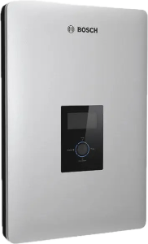

# bosch_bpt_inverter
Home Assistant integration via HACS for Bosch BPT inverters

# Bosch BPT Inverter Integration für Home Assistant

Diese Custom Integration ermöglicht es, den Bosch BPT-S 4.6 PV Inverter (Photovoltatik Wechselrichter) via RESTful API auszulesen und diverse Sensoren in Home Assistant bereitzustellen.

## Installation

### Über HACS (empfohlen)
1. Öffne HACS in Home Assistant.
2. Klicke auf "Integrations" und dann auf "Custom repositories" hinzufügen.
3. Gib als Repository-URL ein: `https://github.com/alpenfun/bosch_bpt_inverter`
4. Wähle "Integration" als Kategorie.
5. Füge das Repository hinzu und installiere die Integration.
6. Starte Home Assistant neu.

### Manuelle Installation
1. Klone dieses Repository oder lade es als ZIP herunter.
2. Kopiere den Ordner `bosch_bpt_inverter` (innerhalb von `custom_components`) in den Ordner `custom_components` deiner Home Assistant-Konfiguration.
3. Stelle sicher, dass deine `configuration.yaml` folgenden Eintrag enthält:
    ```yaml
    bosch_bpt_inverter:
      resource: "http://192.168.xxx.xxx" # Füge hier die IP Adresse deines Bosch Wechselrichters hinzu.
    ```
4. Starte Home Assistant neu.

## Konfiguration

Die Integration wird über die YAML-Konfiguration (nur die Basis-URL) konfiguriert:
```yaml
bosch_bpt_inverter:
  resource: "http://192.168.xxx.xxx"


